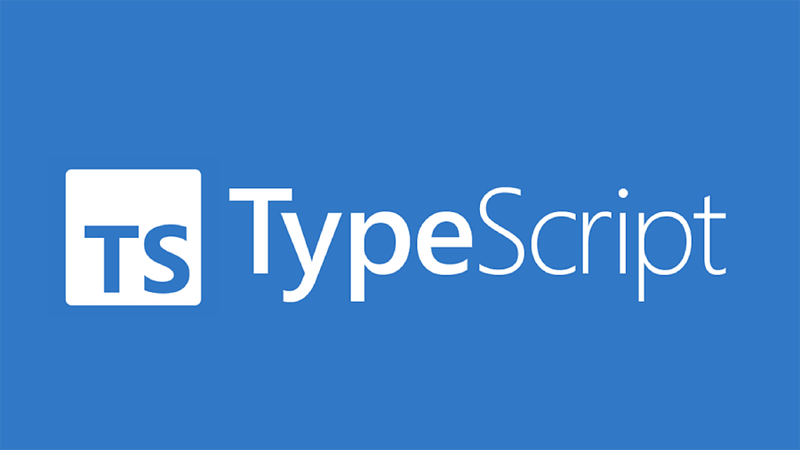

When it came to my first time experiencing TypeScript, it was different from the many other coding languages/softwares I have used. As much as certain mechanics featured in TypeScript were ones I have learned with past coding languages (IE. Creating strings, methods, etc), there are certain ways that the style TypeScript offered was different (IE. number/let being used instead of int, variables being initialized through "(variable): (type);" instead of "(type) (variable);", etc). Nonetheless, it was still easy for me to understand the basics to TypeScript's style of coding, as much as I am only a newbie who has only used the software for less than a month as of the time of me writing this essay.

## Do I think that TypeScript is a good coding language?

I'm well aware that a some people are going to say that TypeScript's mechanics are no different to other coding languages. That being said, for me personally, TypeScript is a pretty good language from my use of it. It is basically just JavaScript with additional features added to it in a way that it can be a lot more convenient to use compared to other coding languages.

## What do I think of athletic software engineering?

When it came to experiencing athletic software engineering, oh brother. I know I've had about 4 years of coding experience, but the fact that this encourages me to demonstrate my skills in programming while giving it my all was the real difficult challenge. That being said, I think this "challenge" marks a milestone in my coding years that I am in the advanced era where I must try my very best to write efficient code within a short set amount of time. As such, I found the WODs to be very difficult without trying to use AI to complete them, but at the same time, it has taught me valuable skills that can be useful for later coding exercises such as advanced problem solving that really puts me to work. This style of learning can certainly feel stressful to many, but for me, I try to keep it cool. As a matter of fact, I think it's a nice life challenge for me, as they always say that life isn't without its obstacles. I'm pretty sure that's normal for everyone, and eventually, they (myself included) are going to get used to it. Overall, I'm certain this style of learning will work for me as it is necessary to learn these skills from trial and error to prepare for more difficult tasks I may come by in the future to put my skills to the test.
