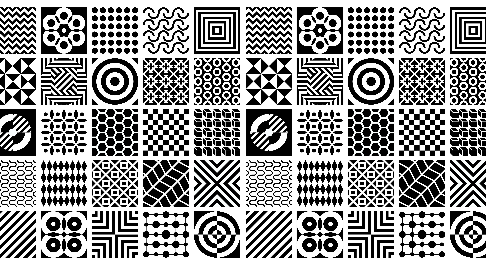

## Introduction

TEXT

## My personal experience with AI

TEXT

## AI's Impact on Learning and Understanding Things

TEXT

## Applications with AI

TEXT

## Challenges and Opportunities with AI

TEXT

## Teaching Methods VS AI

TEXT

## What AI might be like in the future

TEXT

## Conclusion

TEXT

DISCLAIMER: I did not use AI to write this essay.
