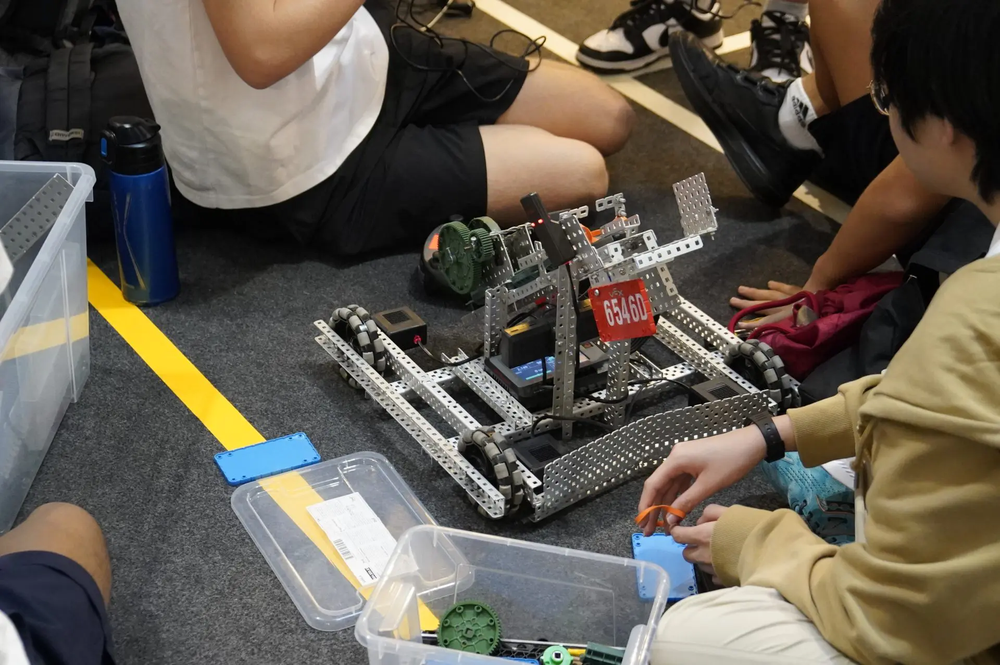

When I was in 11th grade, I was taking high school Computer Schence class. Within the final semester of said class, we had a project where we had to configure and control a motor robot. We did this by configuring some wires to it and writing code to command it on what it should do (IE. move, turn, pick up things with its arms, etcetera). It was certainly a fun experience.
